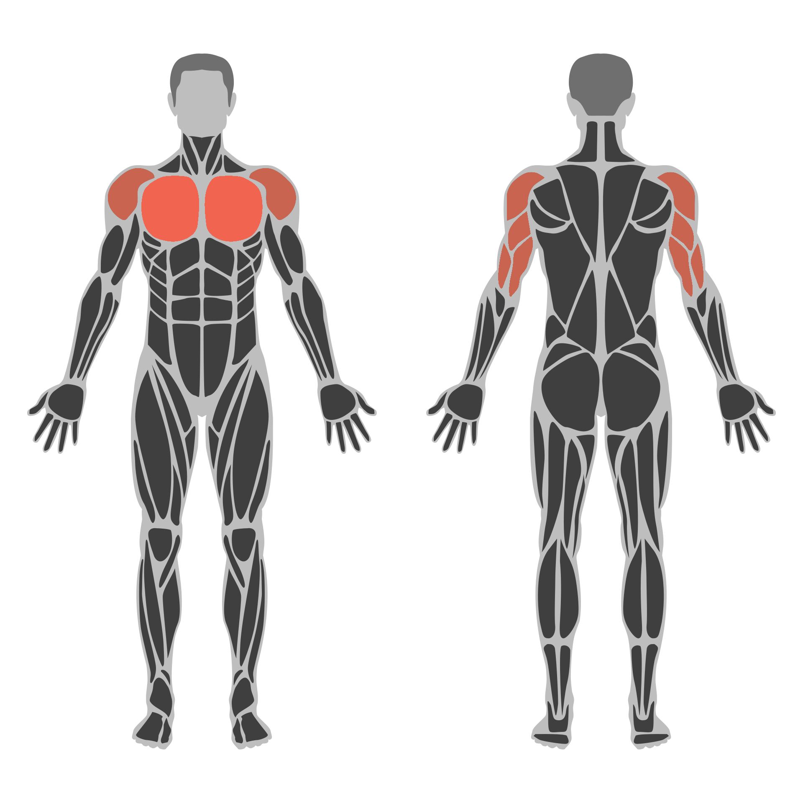

# Musclegroup Image Generator API

Generates an anatomical image where the requested muscle groups are highlighted on the body in your color of choice. Ideal for Apps and Websites that are centered around sports, exercises, workouts, health and gym. Give your users some visual feedback on what muscle groups they are training by dynamically generating an image that fits perfectly to the current users workout routine.



# API Endpoint Documentation

This documentation provides an overview of all available endpoints in the Muscle Group Image Generator API. Each endpoint returns an image or an appropriate error message in JSON format.

## Overview

- [GET /getMuscleGroups](#get-getmusclegroups)
- [GET /getBaseImage](#get-getbaseimage)
- [GET /getImage](#get-getimage)
- [GET /getMulticolorImage](#get-getmulticolorimage)
- [GET /getIndividualColorImage](#get-getindividualcolorimage)

---

## GET /getMuscleGroups

This endpoint returns a list of all available muscle groups.

### Query Parameters
None.

### Possible Calls
- `/getMuscleGroups`
- `/getMuscleGroups?`

### Example
```bash
curl -X GET "http://localhost/getMuscleGroups"
```

---

## GET /getBaseImage

This endpoint returns the base image (e.g., a silhouette or basic layout).

### Query Parameters
- `transparentBackground` (optional, default `0`): An integer value indicating whether the background should be transparent (`1`) or not (`0`).

### Possible Calls
- `/getBaseImage`
- `/getBaseImage?` (no parameters)
- `/getBaseImage?transparentBackground=1`

### Example
```bash
curl -X GET "http://localhost/getBaseImage?transparentBackground=1"
```

---

## GET /getImage

This endpoint returns an image in which certain muscle groups can be highlighted. An optional custom color can be specified for highlighting the muscles.

### Query Parameters
- `muscleGroups` (**required**): A string specifying which muscles to highlight. Multiple muscle groups can be separated by commas.
- `color` (optional): The color used for highlighting the muscles (e.g., in hex notation `FF0000`).
- `transparentBackground` (optional, default `0`): An integer value indicating whether the background should be transparent (`1`) or not (`0`).

### Possible Calls
- `/getImage?muscleGroups=MUSCLE_GROUPS&color=COLOR&transparentBackground=0_or_1`

&gt; **Note**: If `color` is not specified, a default color is used.

### Example
```bash
curl -X GET "http://localhost/getImage?muscleGroups=biceps,triceps&color=FF0000&transparentBackground=1"
```

---

## GET /getMulticolorImage

This endpoint produces an image in which two sets of muscle groups are highlighted using different colors.

### Query Parameters
- `primaryMuscleGroups` (**required**): A string containing the primary muscle groups.
- `secondaryMuscleGroups` (**required**): A string containing the secondary muscle groups.
- `primaryColor` (**required**): The color for the primary muscle groups.
- `secondaryColor` (**required**): The color for the secondary muscle groups.
- `transparentBackground` (optional, default `0`): An integer value indicating whether the background should be transparent (`1`) or not (`0`).

### Possible Calls
- `/getMulticolorImage?primaryMuscleGroups=GROUPS&secondaryMuscleGroups=GROUPS&primaryColor=COLOR&secondaryColor=COLOR&transparentBackground=0_or_1`

### Example
```bash
curl -X GET "http://localhost/getMulticolorImage?primaryMuscleGroups=biceps&secondaryMuscleGroups=triceps&primaryColor=FF0000&secondaryColor=00FF00&transparentBackground=1"
```

---

## GET /getIndividualColorImage

This endpoint allows you to assign individual colors for each muscle group. Both the muscle groups and their colors are provided as comma-separated strings.

### Query Parameters
- `muscleGroups` (**required**): A comma-separated string of muscle groups, for example `biceps,triceps`.
- `colors` (**required**): A comma-separated string of colors, for example `FF0000,00FF00`.
- `transparentBackground` (optional, default `0`): An integer value indicating whether the background should be transparent (`1`) or not (`0`).

&gt; **Note**: The number of colors in `colors` should match the number of muscle groups in `muscleGroups`.

### Possible Calls
- `/getIndividualColorImage?muscleGroups=GROUPS&colors=COLORS&transparentBackground=0_or_1`

### Example
```bash
curl -X GET "http://localhost/getIndividualColorImage?muscleGroups=biceps,triceps&colors=FF0000,00FF00&transparentBackground=1"
```

