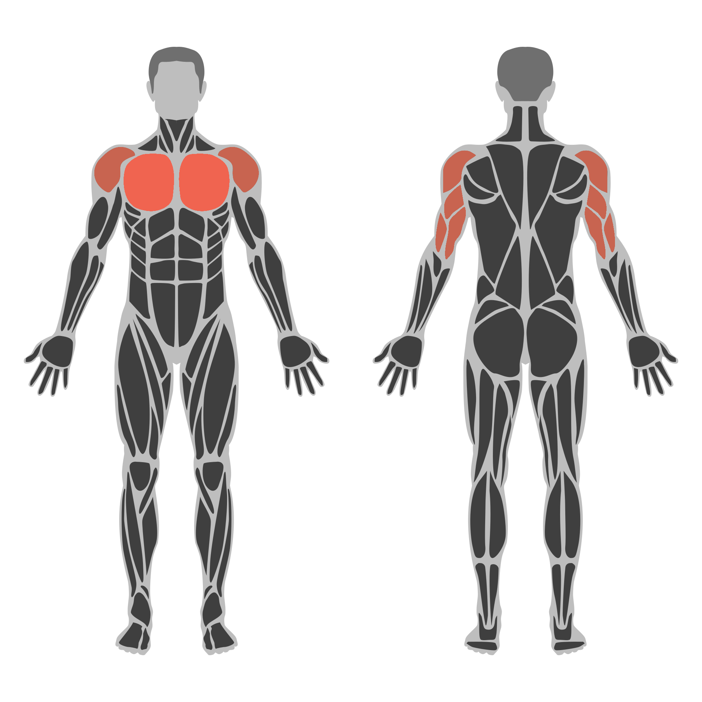

# 🏋️‍♂️ [Musclegroup Image Generator API](https://rapidapi.com/mertronlp/api/muscle-group-image-generator)

[](https://rapidapi.com/mertronlp/api/muscle-group-image-generator)
[](#)
[](#)

Generates an anatomical image where requested muscle groups are dynamically highlighted on the human body in your color of choice. 

Ideal for apps and websites centered around **sports, exercises, workouts, health, and gym tracking**. Give your users powerful visual feedback on which muscle groups they are targeting by generating dynamic, customized images that fit perfectly into their current workout routine.



---

## 🚀 Live API Access

Don't want to host it yourself? You can access the fully managed, high-availability version of this API on RapidAPI:
👉 **[Get API Key on RapidAPI](https://rapidapi.com/mertronlp/api/muscle-group-image-generator)**

---

## 📖 API Endpoint Documentation

This documentation provides an overview of all available endpoints in the Muscle Group Image Generator API. Each endpoint returns an image file or an appropriate JSON error message if the parameters are invalid.

### Overview of Endpoints
- `GET /getMuscleGroups`
- `GET /getBaseImage`
- `GET /getImage`
- `GET /getMulticolorImage`
- `GET /getIndividualColorImage`

---

### `GET /getMuscleGroups`
Returns a list of all available and supported muscle groups that can be highlighted by this API.

**Possible Calls:**
- `/getMuscleGroups`

---

### `GET /getBaseImage`
Returns the blank, non-highlighted anatomical base image. Useful if you need the default silhouette.

**Query Parameters:**
- `transparentBackground` *(optional, default: `0`)*: Integer indicating whether the background should be transparent (`1`) or a solid color (`0`).

**Possible Calls:**
- `/getBaseImage`
- `/getBaseImage?transparentBackground=1`

---

### `GET /getImage`
Returns an image in which specific muscle groups are highlighted in a single color. 

**Query Parameters:**
- `muscleGroups` *(required)*: A string specifying which muscles to highlight. Multiple muscle groups can be separated by commas (e.g., `abs,chest`).
- `color` *(optional)*: The color used for highlighting the muscles. Supported formats:
  - HEX: with or without `#` (e.g., `FF0000` or `#FF0000`)
  - RGB: comma-separated values (e.g., `255,0,0`)
  If omitted, a default color is used.
- `transparentBackground` *(optional, default: `0`)*: `1` for a transparent background, `0` for solid.

**Possible Calls:**
- `/getImage?muscleGroups=chest,triceps&color=FF0000&transparentBackground=1`
- `/getImage?muscleGroups=chest,triceps&color=#FF0000&transparentBackground=1`
- `/getImage?muscleGroups=chest,triceps&color=255,0,0&transparentBackground=1`

---

### `GET /getMulticolorImage`
Produces an image in which two different sets of muscle groups are highlighted using two distinct colors (e.g., to distinguish between primary and secondary targeted muscles in a workout).

**Query Parameters:**
- `primaryMuscleGroups` *(required)*: A comma-separated string containing the primary muscle groups.
- `secondaryMuscleGroups` *(required)*: A comma-separated string containing the secondary muscle groups.
- `primaryColor` *(required)*: The color for the primary muscle groups. Supported formats:
  - HEX: with or without `#` (e.g., `FF0000` or `#FF0000`)
  - RGB: comma-separated values (e.g., `255,0,0`)
- `secondaryColor` *(required)*: The color for the secondary muscle groups. Supported formats as above.
- `transparentBackground` *(optional, default: `0`)*: `1` for transparent, `0` for solid.

**Possible Calls:**
- `/getMulticolorImage?primaryMuscleGroups=chest,triceps&secondaryMuscleGroups=shoulders&primaryColor=FF0000&secondaryColor=0000FF`
- `/getMulticolorImage?primaryMuscleGroups=chest,triceps&secondaryMuscleGroups=shoulders&primaryColor=#FF0000&secondaryColor=#0000FF`
- `/getMulticolorImage?primaryMuscleGroups=chest,triceps&secondaryMuscleGroups=shoulders&primaryColor=255,0,0&secondaryColor=0,0,255`

---

### `GET /getIndividualColorImage`
Allows you to assign completely individual colors for every specific muscle group in a single request. 

**Query Parameters:**
- `muscleGroups` *(required)*: A comma-separated string of muscle groups (e.g., `biceps,triceps`).
- `colors` *(required)*: A comma-separated string of HEX colors (e.g., `FF0000,00FF00,0000FF`).
- `transparentBackground` *(optional, default: `0`)*: `1` for transparent, `0` for solid.

> **Note:** The number of hex codes provided in `colors` *must* match the exact number of muscle groups requested in `muscleGroups`.

**Possible Calls:**
- `/getIndividualColorImage?muscleGroups=biceps,triceps,abs&colors=FF0000,00FF00,0000FF`

---

## 🛠 Self-Hosting / Installation

This project is built using PHP and Docker, making it easy to run locally or host on your own infrastructure.

1. **Clone the repository:**
   ```bash
   git clone [https://github.com/MertenD/gym-api.git](https://github.com/MertenD/gym-api.git)
   cd gym-api
   ```

2. **Run with Docker:**
   *(Assuming standard PHP/Apache dockerfile structure)*
   ```bash
   docker build -t muscle-group-api .
   docker run -d -p 8080:80 muscle-group-api
   ```

3. **Test the API locally:**
   ```bash
   curl "http://localhost:8080/getMuscleGroups"
   ```

---

## 🤝 Support & Contribution

If you find this API helpful, please consider giving it a ⭐ on GitHub! 

If you encounter any issues or want to request a new feature (like a missing muscle group), feel free to [open an issue](https://github.com/MertenD/gym-api/issues) or submit a Pull Request.

**Built by [MertenD](https://github.com/MertenD). Hosted on [RapidAPI](https://rapidapi.com/mertronlp/api/muscle-group-image-generator).**
